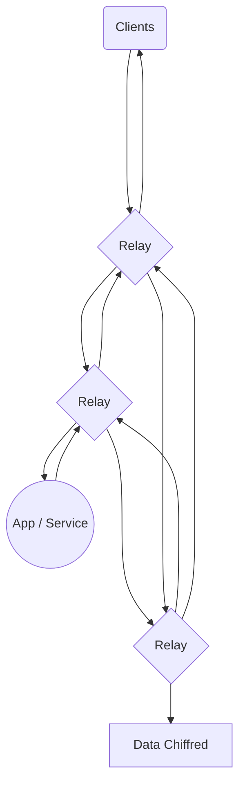

# Bienvenu sur le projet Yuminako Network
Le projet Yuminako Network à pour but de créer un réseau de services décentralisé, interconnecté et sécurisé

# Comment ça marche ?

Et bien c'est très simple, toutes les **données utilisateurs** entré sur Yuminako sont chiffré de manière asynchrone (**chiffrement RSA**)

## Inscription

N'importe qui peux rejoindre librement et gratuitement l'écosystème et le réseau Yuminako via le **Launcher** ou via la **WebApp**  
Lors de son inscription l'utilisateur choisis un **nom d'utilisateur** et un **mot de passe fort**.
Le **Client** de l'utilisateur  (*Launcher* / *Navigateur*) vas générer la clé publique et la clé privée de l'utilisateur.   
Le **Client** de l'utilisateur va ensuite utiliser le mot de passe de l'utilisateur pour chiffrer la clé privée avec **AES-256**
Le **Client** de l'utilisateur va enfin envoyer les deux clé (Clé Publique Claire / Clé Privée Chiffré) ainsi que le nom d'utilisateur.  
Le réseau vas vérifier l'intégrité des donnée, les stocké en bloc et da avant de retournée un succès au client. Si le réseau n'arrive pas a vérifier l'intégrité ou a enregistrer l'utilisateur il renvois un fail avec les détails.

## Connexion

Le client demande au réseau un jeton de connexion. Si le réseau reconnais le client et que le niveau de risque du client est faible alors il retourne au client un jeton de connexion.
Seul les client officiel (YumiLauncher / YumiDashboard) peuvent utiliser l'authentification via username et password, les autres clients ou services tiers devrons utiliser l'API YumiAuth.

### Client Officiel

Apres avoir reçu son jeton d'authentification il envoie le nom d'utilisateur et le mot de passe à un Nœud d'authentification qui va :
- Vérifier l'existence de l'utilisateur.
- Récupérer le processus d'authentification de l'utilisateur 
- Soumettre le client au processus d'authentification
	- Le Client réussi le processus d'authentification
	- Le Noeud Vérifie le mot de passe avec le mot de passe stocké
- Le Réseau retourne une clé de session

### Client Alternatif

Redirection vers YumiAuth API

### Apps / Services Tiers

Redirection vers YumiAuth API

## Base de donnée
Le réseau Yuminako héberge de manière décentralisé (en P2P sur les Nœuds) la base de donnée **YumiData** chargé d'héberger les donnée utilisateurs et les registres (Les registres sont hebergé et controlé par les Noeuds Officels, les donnée utilisateurs elles sont chiffré et transite sur l'ensemble des noeuds du réseau.

# Services & App

Yuminako vous permet de gérer votre / vos identité sur les différents services hébergé sur le réseau. Vous pouvez retrouvez les services officiels de Yuminako et des Services / App tiers proposé par des developpeurs externes.

## Officiels

- YumiChat
	> Echangez des messages de manière sécurisé en P2P sur le réseau Yuminako et intégrez vos Messageries favorites dans une seule App !

- YumiWorld
	> Partagez vos passions et montrez qui vous êtes ou voulez être !
	
	> Explorez et Créez des mondes incroyables cross-platform visitable depuis votre Mobile, PC, ou Casque de VR  
	(objectif)
	
- YumiStream
	> Hebergez ou diffusez vos videos avec vos proches ou votre comunauté et lancez des lives stream ! Chosissez votre audience qu'elle soit Publique ou Privée grâce au chiffrage di réseau Yuminako.
	
- YumiPay
	> Sur Yuminako pas besoin de votre argent, tout se joue avec les YumiCoins !  
	Ils représentent la puissance de calcule que vous coutez au réseau.  
	
	> Les Noeuds (Officiels et Non-Officiels) représentent des coûts réel (Temps / Energie / Matériel). Même si l'objectif est que le réseau soit le moins consommateurs possible, ces couts restent réels. C'est pour cela que le réseau rémunère les Noeuds mensuellement en YumiCoins. Ces Yumicoins peuvent être ensuite enchangé contre d'autres services (Officiels et Tiers) sur le réseau Yuminako.
	
	- **YumiExpress** :  
			Les envoie YumiExpress sont instantané et temporaire dans le réseau Yuminako.  
			Lors d'un transfert, une transaction temporaire est créer sur le réseau Yuminako.  
			Elle est envoyé au destinataire, qui, en cas de débit requerra une approbation par ce même destinataire.
			Une confirmation sera ensuite demandé aux deux utilisateur pour valider le transfert.
			Des validation le transfert est envoyer à 10 Noeuds (dont 3 Officiels) qui validerons la transaction.  
			Une fois validé les Yumicoins sont viré au destinataire et la transaction est effacée.  
			
			> A noter que les envoies YumiExpress sont limité pour éviter de surcharger la RAM des Noeuds.
			
	- **YumiPay** :  
			Lors d'un transfert YumiPay, un contrat et créer et archivé par Yuminako. Ce contrat permettre de paramétrer l'envoie en fonction de conditions temporels (envoies différés ou programmés), Actionnaires (API Yuminako / Services Yuminako)  
			Lors de l'envoie une transaction permanente est créer, elle est validé et approuvé par les deux utilisateurs.  
			Elle est ensuite validé par 50 Noeuds (dont 15 Officiels) du réseau puis sauvegardé.
			Les Coins sont ensuite transféré une fois les conditions du contrat créer.
			Les Coins restent en attente de validation pendant 5 jours (24h en cas de renonciation au droit de rétractation et au droit d'assurance ) 
			
			> En cas de problème vous pouvez signaler la transaction si vous pensez qu'elle va à l'encontre des Conditions Générales du service YumiPay et du réseau Yuminako.  
			Votre signalement est ensuite envoyer aux modérateurs du réseau qui examinent votre demande et emmetent une réponse  
			
			[Incident] Si le modérateur considère un incident il le signale et indique un pourcentage de remboursement en cas de nécessité
			[Fausse Alerte] Si le modérateur ne considère pas qu'il y ai un incident il le signale  
			  
			Une fois l'incident étudié par une 30ene de modérateurs, une moyenne de leur réponse est faite et en cas d'avis favorable sur l'incident, l'utilisateur est remboursé à hauteur de la moyenne des differents remboursements soumis par les modérateurs.  
			Les deux partis peuvent effectuer jusqu'à 3 appels aux décisions des modérateurs mais des signalement une trace de chaque incident (conclus ou non) est créer sur le réseau. Le premier appel est sans frais mais le réseau prendra des frais d'incident croissants au nombre d'appel de décision des modérateurs.
			

- YumiCloud
	> Hébergez vos fichiers et vos sauvegardes et synchronisez les en temps réel et de manière sécurisé avec tous vos services (FTP, SSH, NextCloud, ...)

## Tiers

Les services Tiers sont des services proposé par des particuliers, associations, organismes ou entreprises voulant proposer ou connecter ses services à Yuminako. Les App Tierces sont des services accessible depuis l'interieur ou / et l'extérieur de Yuminako et utilisant l'API pour effectuer des demandes de données Utilisateurs ou interagir avec Yuminako

> Les Apps & Services Tiers doivent respecté la charte Développeur de Yuminako.
> Vous pouvez couper l'accès à vos données et demander la suppression de vos données sur n'importe quel services tiers depuis votre espace Yuminako sous peine de sanction envers l'app / le service concerné.

# Administration / Modération

Durant la phase de développement le superutilisateur Root est activé. Il est le seul utilisateur du réseau à pouvoir altérer le réseau. Il ne peut lire les données privées des utilisateurs / services et les données chiffrés du réseau, mais peux les altérer, modifier, supprimé, ...  
Pour cette raison lors de l'ouverture Officiel du réseau Yuminako ce compte sera désactivé et entièrement automatisé.

## Administration

Aucun Utilisateur ne peux administrer la plateforme. Aucune interface d'administration du réseau n'a été et ne sera mis en place. Les diferents services eux peuvent être administré par leur créateur, mais le réseau est fermé.

## Modération

Yuminako attribue un score de confiance à chaque utilisateur qu'il entretiens en fonction de paramètres (evenements à l'inscription [eviter le spam], participation sur le réseau, incidents, résolution d'incidents ...).  
- Chaque jours le réseau sélectionne en fonction de se classement  10 utilisateurs
- Il leur est demander de lire la Charte de Modération de Yuminako.
- S'ils l'approuvent ils sont tester avec des incidents fictifs
- En fonction du résultat, les 5 utilisateurs avec les meilleurs réponses sont sélectionné.  
- Un mandat de modération de 30 jours est proposé à l'utilisateur
- Un  acompte de 100.00 Y à 555.00 Y est demander en gage d'assurance avant la validation du mandat.

> Les modérateurs ont accès à l'interface de modération de Yuminako. Les modérateurs ne choisissent pas les cas qu'ils traitent, en effet le réseau leur soumet de manière aléatoire des incidents issues des derniers signalement.
> Les moderateurs n'ont pas accès aux données des utilisateurs concerné par des signalements ils n'ont accès qu'à une copie des données transmise par l'utilisateur à l'origine du signalement

> Le mandat des Modérateurs peut être raccourcis, suspendu ou révoqué par le réseau à tout moment et sans préavis ou détails.

# Architecture du réseau
Voici une representation miniature du fonctionnement du réseau avec ici :
- 1 Client 
- 3 Nœud de Relay
- 1 App / Service Tiers
- 1 Noeud de Stockage

# Previsualisez le Futur de Yuminako

Actuellement vous voyez un repository GitHub vide mais si vous voulez jeter un coup d'oeuil à l'apercue publique de Yuminako, j'ouvrirai bientôt les inscription à la version BETA (Centralisé à des fin de prévisualisation) de Yuminako.  
Suivez le Projet et les News depuis notre [Site Web](https://yuminako.com), [DevBlog](https://yuminako.com/devblog), [GitHub](https://github.com/mael-cv/Yuminako-Network), ...

> J'informe que ce projet est mon projet d'étude, il ne sortira pas dans une semaine ou un mois mais risque de prendre quelques années a sortir. Je suis ouvert à toute contribution et espère créer un projet utile qui fera se sentir chacun a sa place

